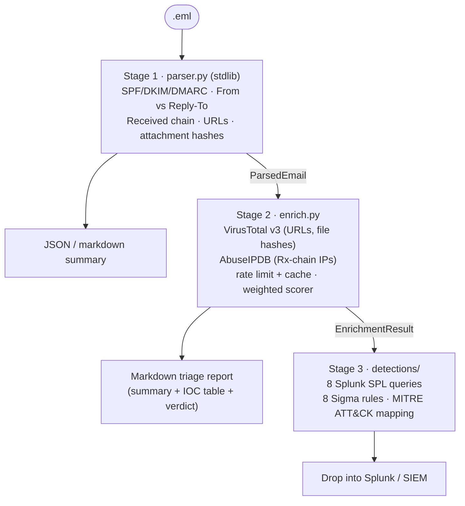

# phish-triage

[](https://www.python.org/)
[](LICENSE)
[](https://attack.mitre.org/)
[](detections/)
[](tests/)

A small, batteries-included **phishing email triage toolkit** for SOC analysts
and detection engineers.

Feed it a single `.eml` file; get back:

1. A **deterministic parse** of every signal that matters — SPF/DKIM/DMARC,
   From vs Reply-To & display-name spoofing, Received-chain anomalies, URLs
   (defanged), attachments with cryptographic hashes.
2. **External enrichment** (VirusTotal v3 + AbuseIPDB free-tier) gated by a
   built-in rate limiter and an on-disk cache.
3. A **weighted 0-100 verdict** (`benign` / `suspicious` / `malicious`) and a
   plain-language rationale.
4. **Eight production-style detections** — Splunk SPL + Sigma — mapped to
   MITRE ATT&CK, that fire on the same signals the tool surfaces.

> ⚙️  Stage 1 is **pure Python 3.11 stdlib**.  Stage 2 only adds `requests`.

📖 **Long-form context:** [why I built this](docs/why.md) · [retrospective](docs/retrospective.md)

## Screenshots

The bundled web UI (`python -m phish_triage.web`, see
[Sample tester](#sample-tester-web-ui) below) lets you drop in any `.eml`
and see the verdict, signals, IOCs, and reasoning side-by-side.

|   |   |
|---|---|
| **Home page — upload or pick a sample**<br> | **Phish sample → MALICIOUS 100/100**<br> |
| **Benign sample → BENIGN 0/100 (no false positives)**<br> | **CLI session — same toolkit, terminal-first**<br> |

## Architecture



## Quickstart

```bash
git clone https://github.com/trac3r00/phish-triage.git
cd phish-triage
python3.11 -m venv .venv && source .venv/bin/activate
pip install -e ".[dev]"

# regenerate the sample fixtures (safe: no real malware)
python -m tests.make_fixtures

# Stage 1 — parse a .eml, print JSON
phish-triage parse tests/fixtures/phish_sample.eml --json

# Stage 1 — same email, markdown summary
phish-triage parse tests/fixtures/phish_sample.eml --markdown

# Stage 2 — parse + enrich (uses env vars; missing keys degrade gracefully)
export VT_API_KEY=<your-vt-key>          # https://www.virustotal.com/gui/my-apikey
export ABUSEIPDB_API_KEY=<your-abuse-key>   # https://www.abuseipdb.com/account/api
phish-triage enrich tests/fixtures/phish_sample.eml --output report.md

# run the test suite
pytest -q
```

## Sample tester (web UI)

```bash
pip install -e ".[web]"
python -m phish_triage.web
# open http://127.0.0.1:5050
```

A single-file Flask app under `src/phish_triage/web/` that lets you upload
any `.eml` or click one of the bundled samples and see the parsed signals,
IOCs, verdict, and rationale rendered as cards.

> ⚠️  The web demo runs the parser + scorer **locally only** — VirusTotal and
> AbuseIPDB are intentionally skipped so the page is safe to share without
> exposing API keys or burning quota.  Add keys back via the CLI
> (`phish-triage enrich …`) when you want the full pipeline.

## Sample output

```text
$ phish-triage enrich tests/fixtures/phish_sample.eml | head -25
# Phishing triage report — Urgent: PayPal account suspended

**Source:** `tests/fixtures/phish_sample.eml`

## Summary

- **Verdict:** `MALICIOUS`
- **Score:** 100 / 100
- **From:** PayPal Security <security-team@paypa1-verify.top>
- **Reply-To:** verify@evil-collector.country
- **Subject:** Urgent: PayPal account suspended

## IOC table

| Type | Value                                            | Notes                |
|------|--------------------------------------------------|----------------------|
| url  | `hxxp://bit[.]ly/paypal-verify-now`              | host `bit.ly`        |
| url  | `hxxps://paypa1-secure-login[.]zip/account`      | host `paypa1...zip`  |
| file | `invoice.html`                                   | sha256 `1fec...f873` |
| ip   | `198.51.100.42`                                  | from Received chain  |
```

## Stage breakdown

### Stage 1 — Parser (pure stdlib)

* Uses `email.policy.default` for RFC 5322 parsing — handles MIME, RFC 2047
  header encoding, quoted-printable / base64 transfer encoding.
* `Authentication-Results` parsed mechanism-by-mechanism; the strongest
  signal wins (a later `none` won't overwrite an earlier `fail`).
* `From` vs `Reply-To` mismatch and display-name brand spoofing detection.
* `Received` chain ordered origin → recipient with **RFC 1918-only** privacy
  detection (RFC 5737 documentation ranges, which test fixtures use as
  stand-in public IPs, are treated as public — see the comment in
  `_is_private`).
* All URLs from every `text/*` body part, deduplicated and defanged
  (`hxxp://`, `[.]`).
* Attachments yield filename, content-type, size, and MD5/SHA1/SHA256.
* Output: JSON or a markdown analyst summary.

[Read the Stage 1 walkthrough →](docs/stage1-parsing-walkthrough.md)

### Stage 2 — Enrichment (`requests` only)

* VirusTotal v3 GET endpoints for URLs (`/urls/{base64id}`) and files
  (`/files/{sha256}`), bounded by a 4 req/min RateLimiter that matches the
  free-tier quota.
* AbuseIPDB `/check` for every **public** Received-chain hop.
* Missing API key? The source is skipped, a line is added to the
  `Notes` section of the report, scoring continues with whatever's left.
* Responses cached under `.cache/` keyed by `(source, IOC)` so re-runs don't
  burn quota.
* Verdict scoring: signal weights + VT detections + AbuseIPDB confidence
  bounded 0-100, mapped to benign / suspicious / malicious at 40 / 70.

[Read the Stage 2 walkthrough →](docs/stage2-enrichment-walkthrough.md)

### Stage 3 — Detections (Splunk SPL + Sigma)

* Eight rules in both SPL and Sigma covering every category of signal the
  parser surfaces.
* `detections/README.md` carries the rule ↔ parser signal ↔ MITRE ATT&CK
  table.

[Read the detection-engineering write-up →](docs/stage3-detection-engineering.md)

## MITRE ATT&CK mapping

| Rule | Technique(s) |
|------|--------------|
| R01 SPF fail + From/Reply-To mismatch | [T1566.001](https://attack.mitre.org/techniques/T1566/001/), [T1566.002](https://attack.mitre.org/techniques/T1566/002/) |
| R02 New sender domain + auth fail | [T1566](https://attack.mitre.org/techniques/T1566/) |
| R03 Brand / exec display-name spoof | [T1656](https://attack.mitre.org/techniques/T1656/), [T1566.001/002](https://attack.mitre.org/techniques/T1566/) |
| R04 URL shortener in mail | [T1566.002](https://attack.mitre.org/techniques/T1566/002/), [T1204.001](https://attack.mitre.org/techniques/T1204/001/) |
| R05 Attachment hash → VirusTotal | [T1566.001](https://attack.mitre.org/techniques/T1566/001/) |
| R06 Suspicious TLD link | [T1566.002](https://attack.mitre.org/techniques/T1566/002/), [T1583.001](https://attack.mitre.org/techniques/T1583/001/) |
| R07 Base64 HTML body with form | [T1027](https://attack.mitre.org/techniques/T1027/), [T1566.001](https://attack.mitre.org/techniques/T1566/001/) |
| R08 DMARC reject bypass | [T1566](https://attack.mitre.org/techniques/T1566/), defense_evasion |

## Project layout

```
phish-triage/
├── src/phish_triage/
│   ├── __init__.py
│   ├── parser.py       Stage 1 — stdlib-only parser
│   ├── enrich.py       Stage 2 — VT + AbuseIPDB + scoring
│   ├── cli.py          argparse front-end (phish-triage parse|enrich)
│   └── web/            Stage 4 — single-file Flask sample tester
│       ├── __init__.py
│       ├── __main__.py
│       ├── templates/{index,report}.html
│       └── static/style.css
├── tests/
│   ├── fixtures/
│   │   ├── benign.eml          regenerated from make_fixtures.py
│   │   └── phish_sample.eml
│   ├── make_fixtures.py        no real malware — only signal patterns
│   ├── test_parser.py          9 cases
│   ├── test_enrich.py          11 cases, HTTP fully mocked
│   └── test_web.py             8 cases — Flask test client
├── detections/
│   ├── spl/                     R01-R08 (.spl)
│   ├── sigma/                   R01-R08 (.yml, uuid4 ids, MITRE tags)
│   └── README.md                signal → rule → ATT&CK mapping
├── docs/
│   ├── why.md                              why I built this
│   ├── retrospective.md                    what worked, what bit me
│   ├── stage1-parsing-walkthrough.md
│   ├── stage2-enrichment-walkthrough.md
│   ├── stage3-detection-engineering.md
│   └── screenshots/                        README image assets
└── pyproject.toml
```

## Testing

```bash
pytest -q          # 28 tests, all green, no live API calls
```

The enrichment tests use `unittest.mock.patch` against
`phish_triage.enrich.requests.Session.get`, so the suite is **safe to run
without API keys** and **never** burns quota.

## Safety / scope

* `tests/make_fixtures.py` deliberately constructs the phishing fixture from
  inert text — there is **no real malware** in this repo.
* The toolkit only performs **read-only** lookups against public APIs.
* No `eval` / `exec` / `shell=True` anywhere; no hardcoded credentials.

## License

MIT — see [LICENSE](LICENSE).
