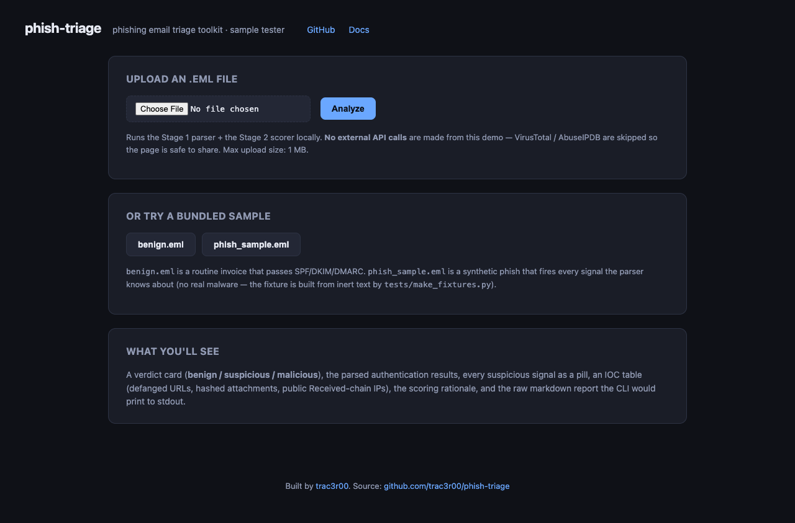
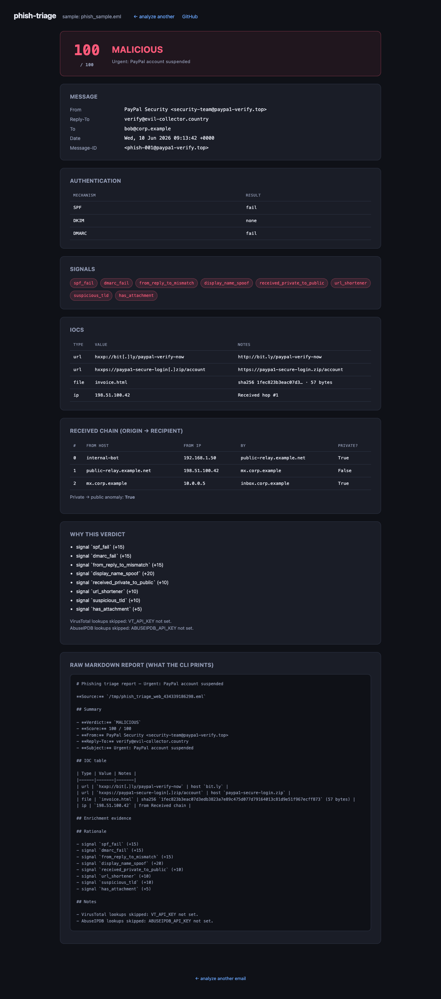
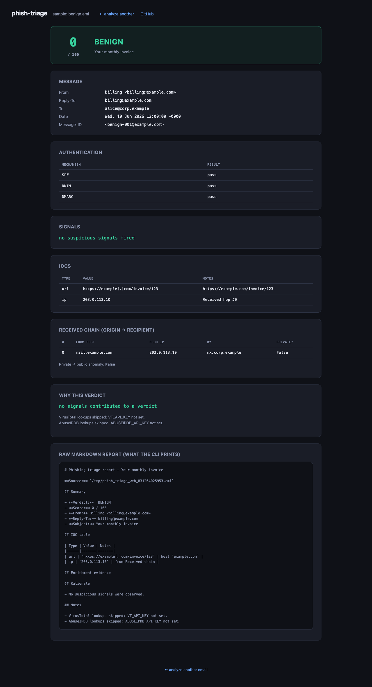
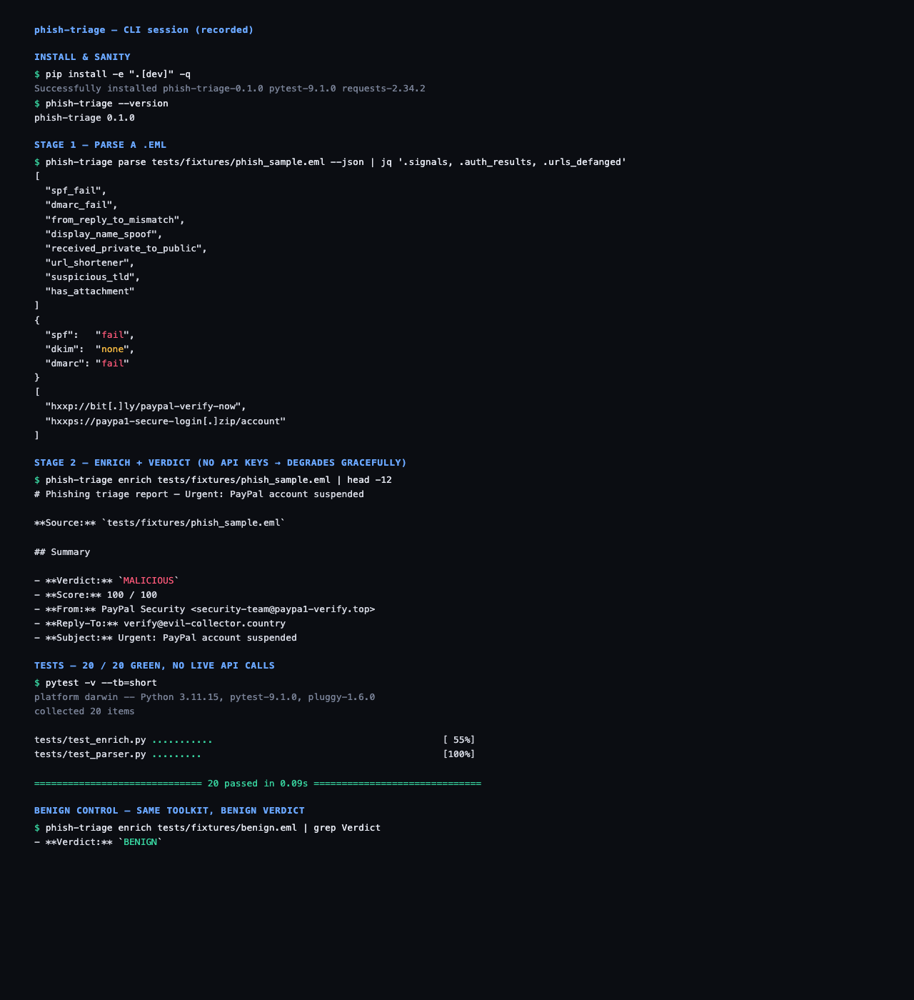

# phish-triage

Parse phishing email files, enrich indicators, and produce analyst-oriented reports and detection content.

[](https://www.python.org/)
[](LICENSE)

## Overview

`phish-triage` is a Python toolkit for examining a single RFC 5322 `.eml` file. It extracts authentication results, sender inconsistencies, delivery-chain details, URLs, and attachment hashes. The optional enrichment command checks URLs and attachment hashes with VirusTotal and public delivery-chain IPv4 addresses with AbuseIPDB, then calculates a deterministic score and renders a report.

The repository also includes a local Flask interface, inert sample messages, and example Splunk SPL and Sigma detection rules. The detection rules are deployment templates with their own gateway-field assumptions; they are not executed by the CLI.

## Features

- Parses SPF, DKIM, and DMARC results from `Authentication-Results` headers.
- Compares `From` and `Reply-To` addresses and checks selected brand names in the sender display name.
- orders `Received` headers from origin to recipient and identifies private-to-public transitions.
- extracts and defangs URLs from decoded `text/*` MIME parts.
- records attachment metadata and MD5, SHA-1, and SHA-256 hashes.
- queries VirusTotal for URLs and attachment SHA-256 hashes.
- Queries AbuseIPDB for non-private dotted-quad address values found in the `Received` chain.
- caches enrichment responses and produces JSON or Markdown output.
- assigns `benign`, `suspicious`, or `malicious` verdicts using documented weights.
- provides a local web interface and eight example rules in both SPL and Sigma formats.

## Screenshots

| | |
|---|---|
| **Home page**<br> | **Phishing sample report**<br> |
| **Benign sample report**<br> | **CLI session**<br> |

## Architecture

```text
                         +----------------------+
.eml file -------------->| parser.py            |
                         | headers, MIME, IOCs   |
                         +----------+-----------+
                                    |
                         +----------+-----------+
                         |                      |
                         v                      v
                 JSON / Markdown        enrich.py
                 parser output          VT + AbuseIPDB + cache
                                                |
                                                v
                                      JSON / Markdown report

Local web UI -> parser.py -> enrich.py -> HTML report

detections/ contains independent SPL and Sigma deployment templates.
```

`parser.py` uses only the Python standard library. The installed package includes `requests` for enrichment. Flask is available through the `web` optional dependency.

## Installation

Python 3.11 or later is required.

```bash
git clone https://github.com/Trac3r00/phish-triage.git
cd phish-triage
python3 -m venv .venv
source .venv/bin/activate
python -m pip install --upgrade pip
python -m pip install -e .
```

For local development and the web interface:

```bash
python -m pip install -e ".[dev,web]"
```

On Windows PowerShell, activate the virtual environment with `.venv\Scripts\Activate.ps1`.

## Usage

### Parse an email

JSON is the default output format:

```bash
phish-triage parse message.eml
phish-triage parse message.eml --json
```

Render a human-readable summary or write it to a file:

```bash
phish-triage parse message.eml --markdown
phish-triage parse message.eml --markdown --output summary.md
```

### Enrich indicators and score the message

```bash
phish-triage enrich message.eml
phish-triage enrich message.eml --output report.md
phish-triage enrich message.eml --json --output report.json
```

Enrichment uses `.cache/` by default. Select another directory with `--cache-dir PATH`, or use `--no-cache` to disable cache reads and writes for that run. Missing API keys cause the corresponding provider to be skipped; scoring still uses parser signals and any available provider.

### Run the local web interface

Install the `web` extra, then start the Flask application:

```bash
python -m pip install -e ".[web]"
python -m phish_triage.web
```

Open <http://127.0.0.1:5050>. The server binds to `127.0.0.1`, accepts `.eml` uploads up to 1 MB, exposes `GET /healthz`, and includes the sample messages under `tests/fixtures/` when run from a source checkout.

The web interface calls the same enrichment code as the CLI with caching disabled. If `VT_API_KEY` or `ABUSEIPDB_API_KEY` is present in the server environment, submitting a message can make live requests to that provider. Leave both variables unset to run the interface using parser signals only.

### Use the bundled samples

The repository contains inert benign and phishing fixtures. Regenerate them and inspect the phishing sample with:

```bash
python -m tests.make_fixtures
phish-triage parse tests/fixtures/phish_sample.eml --markdown
phish-triage enrich tests/fixtures/phish_sample.eml --no-cache
```

The fixtures contain simulated indicators and text content, not malware.

## Configuration

Configuration is supplied through command-line options and environment variables; there is no application configuration file.

| Name | Required | Purpose |
|---|---:|---|
| `VT_API_KEY` | No | Enables VirusTotal URL and attachment-hash lookups. |
| `ABUSEIPDB_API_KEY` | No | Enables AbuseIPDB lookups for non-private dotted-quad address values in the delivery chain. |
| `--cache-dir PATH` | No | Changes the enrichment cache directory from `.cache/`. |
| `--no-cache` | No | Disables enrichment cache reads and writes. |

Do not commit API keys. Provider requests are read-only lookups, but the indicators being queried are disclosed to the selected provider.

## Detection content

The [`detections/`](detections/) directory contains eight SPL queries and eight Sigma rules. They assume normalized secure-email-gateway fields and require environment-specific review, field mapping, allowlists, and validation before deployment. R02 requires sender-domain history, and R05 requires VirusTotal lookup data.

See [Detection content](detections/README.md) for field requirements, rule mappings, and tuning guidance.

## Development

Install the development dependencies and run the test suite:

```bash
python -m pip install -e ".[dev,web]"
pytest
```

The test suite covers parsing, enrichment, caching, scoring, report rendering, and the Flask routes. Network access is mocked in enrichment tests; API keys are not required.

## Project structure

```text
src/phish_triage/
  cli.py               Command-line interface
  parser.py            Email parsing and Markdown summary rendering
  enrich.py            Provider clients, cache, scoring, and reports
  web/                 Local Flask interface
tests/                 Test suite, fixtures, and fixture generator
detections/spl/        Splunk SPL queries
detections/sigma/      Sigma rules
docs/                  Design rationale and implementation walkthroughs
```

## Documentation

- [Parsing walkthrough](docs/stage1-parsing-walkthrough.md)
- [Enrichment walkthrough](docs/stage2-enrichment-walkthrough.md)
- [Detection engineering notes](docs/stage3-detection-engineering.md)
- [Project rationale](docs/why.md)
- [Engineering retrospective](docs/retrospective.md)

## License

Licensed under the [MIT License](LICENSE).
